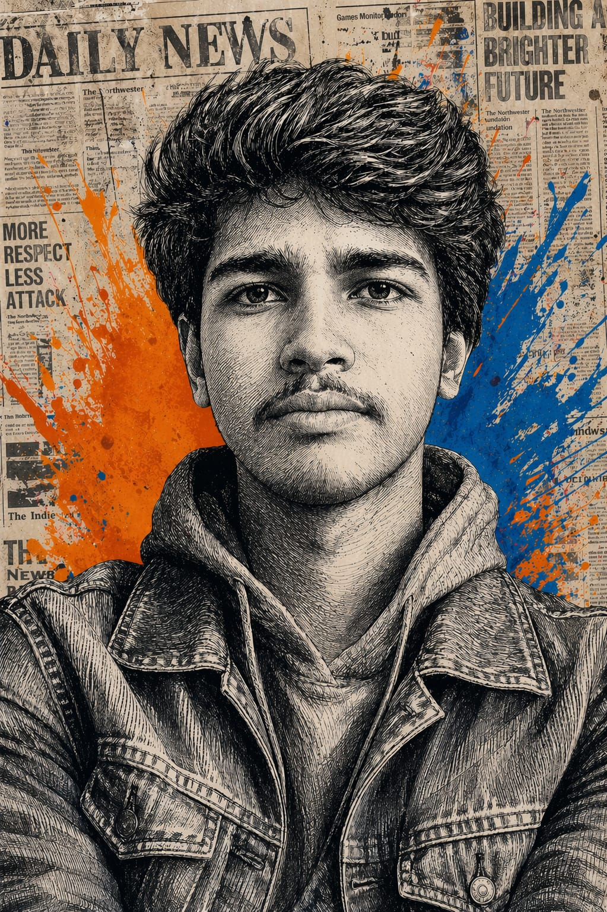
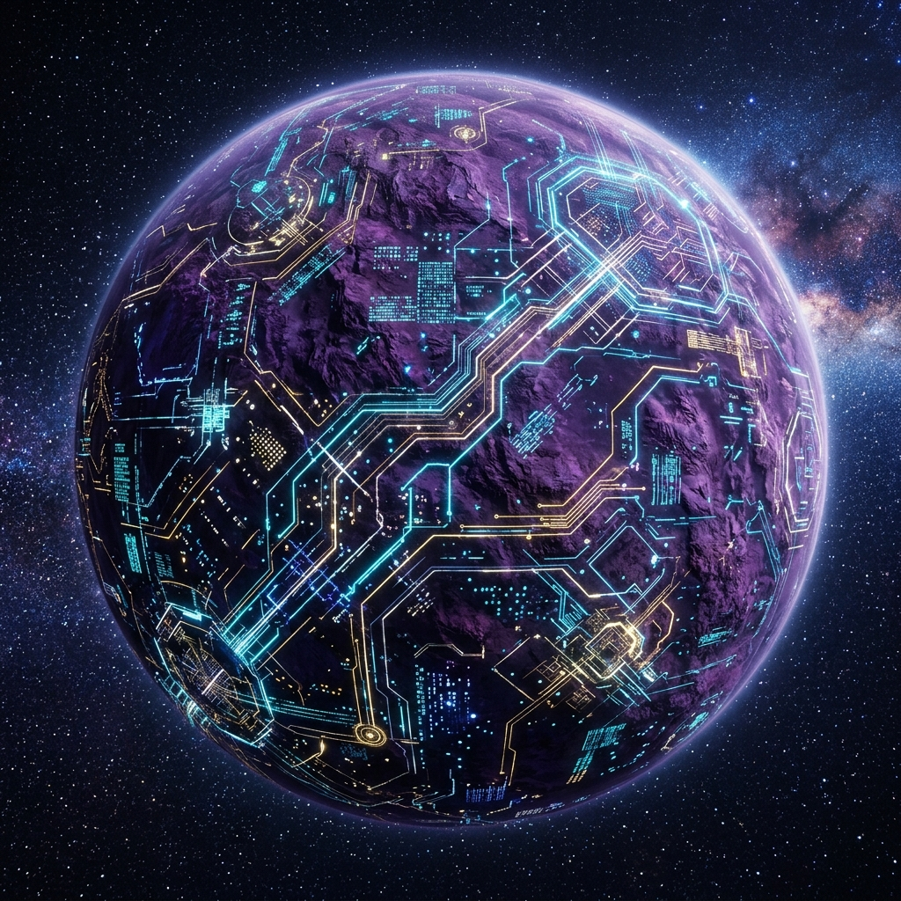
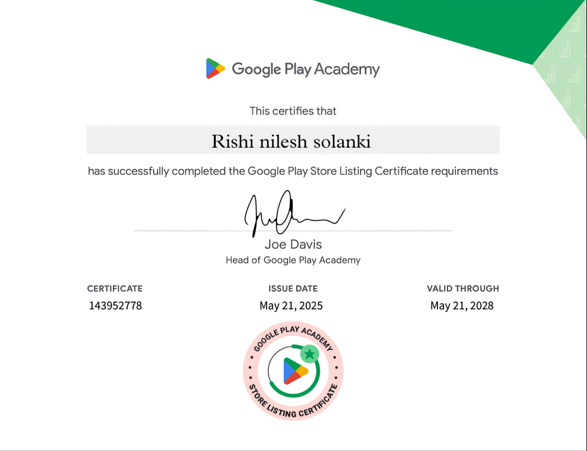
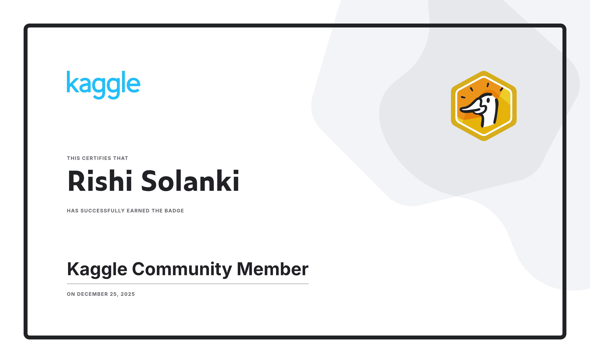
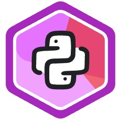

# 
Mission Command: Rishi Solanki (Maruti) 

  
  
  ## ✨ "Jack of all trades, master of none, but often better than master of one." ✨
  
  

    
    
  

  **Full-Stack Developer | UI/UX Visionary | Odoo Specialist | unique web designer | hairstylist**

---

### 🛰️ The Mission Log
I am a creative developer dedicated to engineering high-performance, immersive digital experiences. My work blends cutting-edge technology with futuristic aesthetics, specializing in **Glassmorphism**, **Three.js 3D Environments**, and **Odoo ERP** solutions.

- 🪐 **Navigation**: Currently exploring the frontiers of **3D Web Interactivity**.
- 🛠️ **Systems**: Engineering robust backend logic with **Python**, **Odoo**, and **PostgreSQL**.
- 🚀 **Objective**: To bridge the gap between imagination and functional, premium code.

---

### 🛠️ Command Center (Tech Stack)

  
   
  
  

---

### 🪐 Planetary Systems (Featured Work)

  <table>
    <tr>
      <td align="center">
         
        <b>Interstellar Workspace</b> 
        <i>A cinematic 3D environment built with Three.js.</i>
      </td>
      <td align="center">
         
        <b>Play Store Ventures</b> 
        <i>Mobile applications focused on performance and UX.</i>
      </td>
    </tr>
    <tr>
      <td align="center">
         
        <b>Data Frontiers</b> 
        <i>Recognized Kaggle Community contributor.</i>
      </td>
      <td align="center">
         
        <b>Logic Core</b> 
        <i>Advanced Python logic and backend architectures.</i>
      </td>
    </tr>
  </table>

---

### 📊 Operational Metrics

  
  

  

---

### 📡 Communications Array
- 💼 **LinkedIn**: [Rishi Solanki](https://www.linkedin.com/in/rishi-solanki-505a9b380/?trk=li_LOL_DA_global_careers_jobsgtm_otwGeneral_res_Sep2023_dav2/)
- 🌐 **Portfolio**: [rishi-n-s.github.com](https://github.com/Rishi-n-s)
- 📧 **Email**: [rishisolanki7319@gmail.com](mailto:rishisolanki7319@gmail.com)

 

  
   
  <i>"Ad Astra Per Aspera" — To the stars through difficulties.</i>
   
  <b>© 2026 Rishi Solanki / Maruti</b>

