

  

  <a href="https://rishi-n-solanki.vercel.app" target="_blank">
    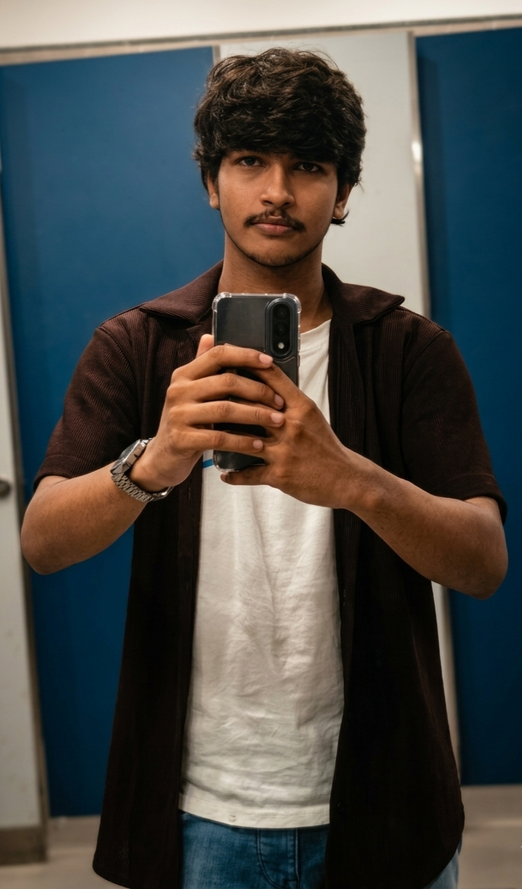
  </a>

  <h2>🚀 Rishi Solanki (Maruti / <code>not.a.superman</code>)</h2>

  

    <em>"Jack of all trades, master of none, but often better than master of one."</em>
  

  

    
    
    
    
  

  

    <strong>Full-Stack & Creative 3D Developer</strong> | <strong>AI Agent & Vibe Coder</strong> | <strong>Google Student Ambassador (2025–2027)</strong> | <strong>Salon Business Founder (Vaitu)</strong>
  

---

### 🛰️ The Mission Log (About Me)

I am a creative developer, UI/UX craftsman, and entrepreneur from **Veraval & Ahmedabad, Gujarat**, currently pursuing **BCA (Semester 2) at Gujarat Vidyapith**. I engineer high-performance, immersive web applications combining futuristic glassmorphism, 3D WebGL worlds (Three.js), and autonomous AI agent architectures.

- 🎓 **Education**: BCA @ Gujarat Vidyapith | Schooling at ISB (Bahrain), DPS & St. Mary's High School (Veraval).
- 🌟 **Google Student Ambassador (2025–2027)**: Leading campus outreach, cloud study jams, and technical hackathons for **200+ students** (GSA ID: `GSA-2025-IND-884`).
- 💼 **Entrepreneurship**: Founder & Master Stylist at **Vaitu** — leading digital branding, local SEO, and operations serving 200+ clients.
- 🪐 **Creative Frontiers**: Mastering **Three.js 3D environments**, motion-controlled flight simulations, and LLM-powered multi-agent pipelines.
- ⚡ **Philosophy**: Bridging the gap between pure artistic imagination and clean, scalable code.

---

### 🛠️ Command Center (Tech Stack & Arsenal)

  

 

| Domain | Technologies & Frameworks |
| :--- | :--- |
| **Frontend & Styling** | `HTML5`, `CSS3 (Vanilla)`, `JavaScript (ES6+)`, `React.js`, `Tailwind CSS`, `GSAP` |
| **3D & Creative Web** | `Three.js`, `WebGL`, `Vanilla-Tilt.js`, `Glassmorphism UI`, `Spatial Audio` |
| **AI & Intelligent Systems** | `Multi-Agent Systems`, `Vibe Coding`, `Google Gemini API`, `Claude API`, `Ollama (Local LLMs)`, `RAG` |
| **Backend & Databases** | `Python`, `PostgreSQL`, `Supabase`, `Odoo ERP`, `REST APIs`, `Local Storage` |
| **Tools, DevOps & Mobile** | `Git`, `GitHub`, `Vercel`, `Netlify`, `Google Play Console`, `Google Analytics` |

---

### 🪐 Planetary Systems (Featured Projects)

  <table>
    <tr>
      <td width="50%" align="center" valign="top">
        <a href="https://rishi-n-solanki.vercel.app" target="_blank">
          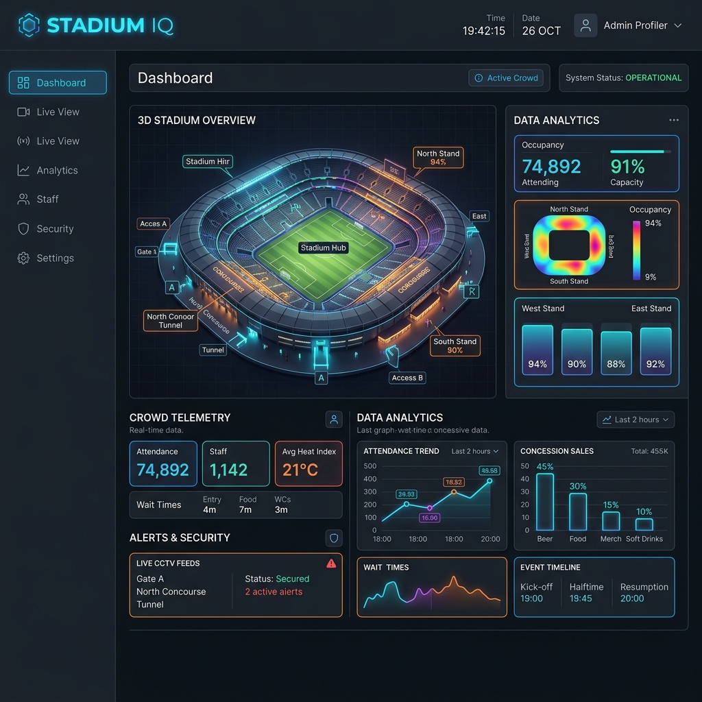
        </a>
         
        <h3>🏟️ 01. StadiumIQ</h3>
        

          Next-generation <b>Smart Venue Operating System</b> engineered for real-time crowd telemetry, dynamic venue ops, and automated stadium intelligence.
        

        

          <code>React.js</code> <code>Tailwind CSS</code> <code>Realtime Telemetry</code> <code>Smart Ops</code>
        

      </td>
      <td width="50%" align="center" valign="top">
        <a href="https://rishi-n-solanki.vercel.app" target="_blank">
          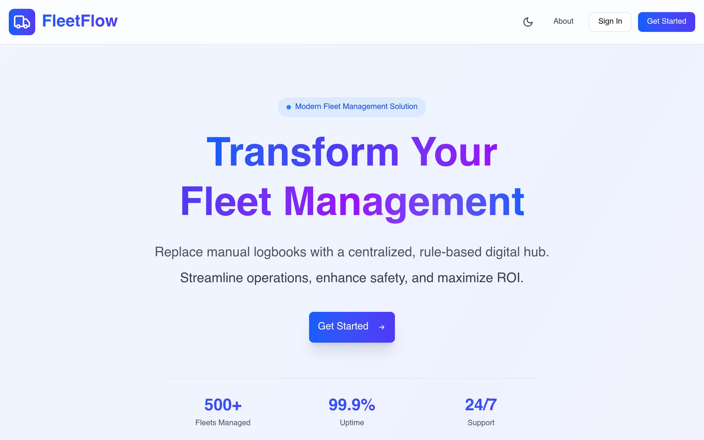
        </a>
         
        <h3>🚚 02. Fleet Flow ERP</h3>
        

          Comprehensive <b>Enterprise Resource Planning (ERP)</b> platform designed for modern logistics, vehicle tracking, route optimization (-20% dispatch delay), and financial telemetry.
        

        

          <code>React.js</code> <code>Supabase</code> <code>ERP Logic</code> <code>PostgreSQL</code>
        

      </td>
    </tr>
    <tr>
      <td width="50%" align="center" valign="top">
        <a href="https://rishi-n-solanki.vercel.app" target="_blank">
          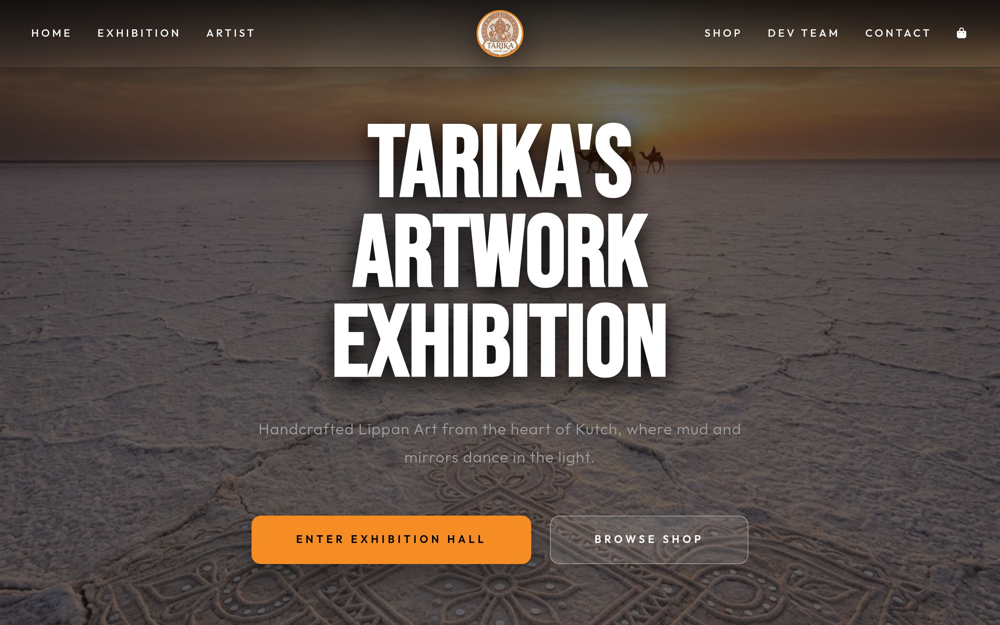
        </a>
         
        <h3>🎨 03. Tarika Lippan Art</h3>
        

          Immersive online gallery and e-commerce store showcasing traditional & modern <b>Kutch Lippan Mirror Art</b> with interactive micro-animations and custom orders.
        

        

          <code>React.js</code> <code>Stripe API</code> <code>UI/UX Art</code> <code>CSS Motion</code>
        

      </td>
      <td width="50%" align="center" valign="top">
        <a href="https://rishi-n-solanki.vercel.app" target="_blank">
          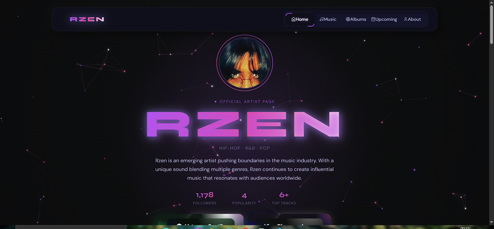
        </a>
         
        <h3>🎵 04. Rzen Music</h3>
        

          Dark-cyberpunk artist portal integrated with <b>Spotify Web API</b>, dynamic top track streaming, album widgets, and release countdowns (+30% listener engagement).
        

        

          <code>React.js</code> <code>Spotify API</code> <code>Cyberpunk UI</code> <code>Web Audio</code>
        

      </td>
    </tr>
    <tr>
      <td width="50%" align="center" valign="top">
        <a href="https://rishi-n-solanki.vercel.app" target="_blank">
          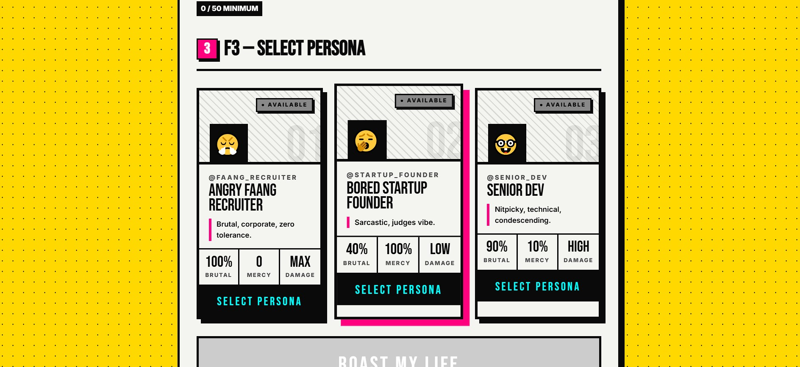
        </a>
         
        <h3>🔥 05. Roast My Resume</h3>
        

          AI-powered web application that analyzes and roasts resumes with <b>Google Gemini API</b> intelligence, ATS match scoring, and diagnostic feedback for 500+ job seekers.
        

        

          <code>Google Gemini API</code> <code>React.js</code> <code>AI Prompting</code> <code>ATS Diagnostics</code>
        

      </td>
      <td width="50%" align="center" valign="top">
        
         
        <h3>🌌 06. 3D Interstellar Workspace</h3>
        

          Procedurally generated 3D solar system featuring <b>8 orbiting project planets</b>, realistic ship cockpit, and mobile gyroscope/motion flight controls.
        

        

          <code>Three.js</code> <code>WebGL</code> <code>Gyroscope API</code> <code>Vanilla-Tilt</code>
        

      </td>
    </tr>
  </table>

---

### 📜 Verified Credentials & Achievement Gallery

  <table>
    <tr>
      <td width="33%" align="center" valign="top">
        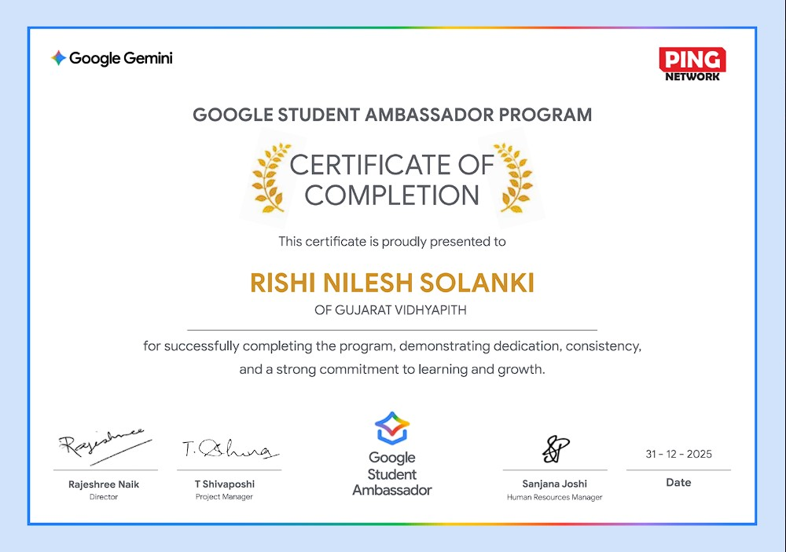
         
        <b>Google Student Ambassador</b> 
        <i>Cohort 2025–2027 • Cloud & Campus Tech</i>
      </td>
      <td width="33%" align="center" valign="top">
        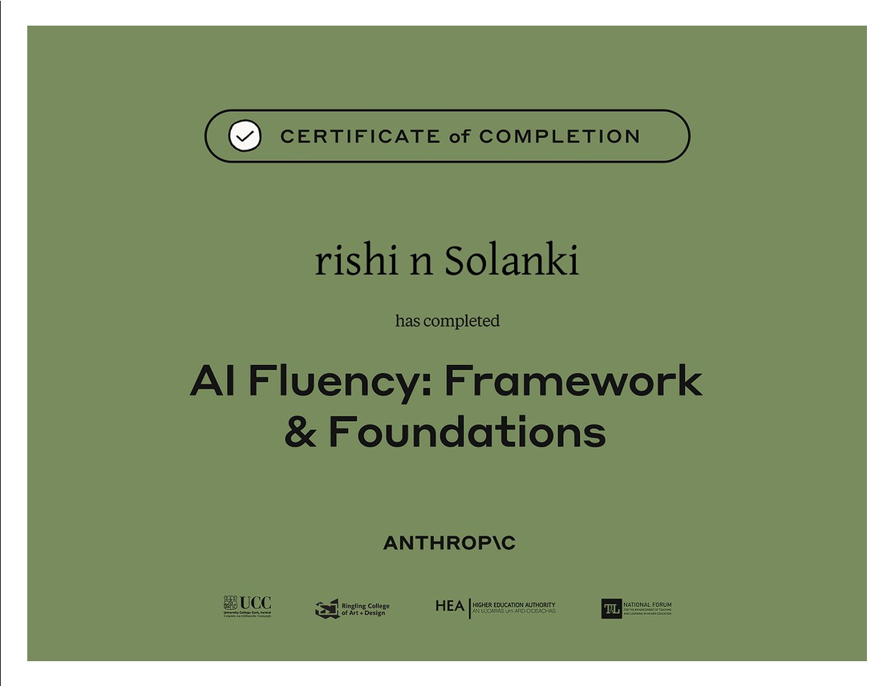
         
        <b>Anthropic AI Fluency</b> 
        <i>Claude LLM Frameworks & Foundations</i>
      </td>
      <td width="33%" align="center" valign="top">
        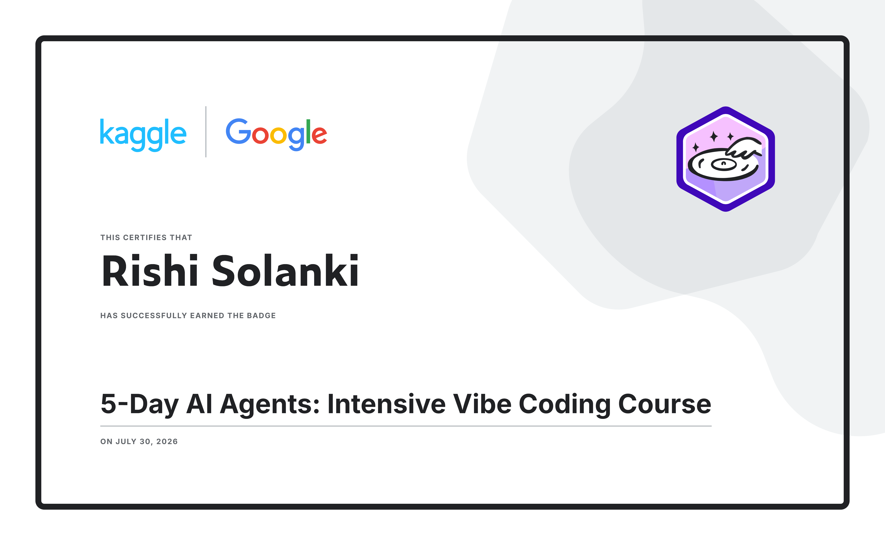
         
        <b>5-Day AI Agents Course</b> 
        <i>Intensive Vibe Coding & Multi-Agent Systems</i>
      </td>
    </tr>
    <tr>
      <td width="33%" align="center" valign="top">
        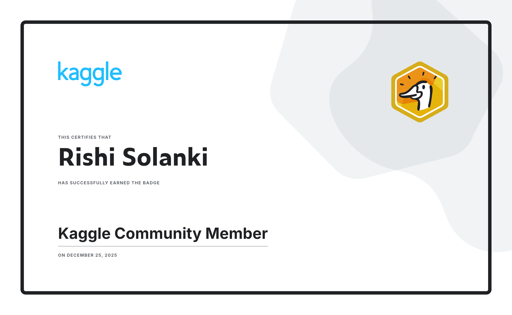
         
        <b>Kaggle Community Member</b> 
        <i>Data Science & ML Community Contributor</i>
      </td>
      <td width="33%" align="center" valign="top">
        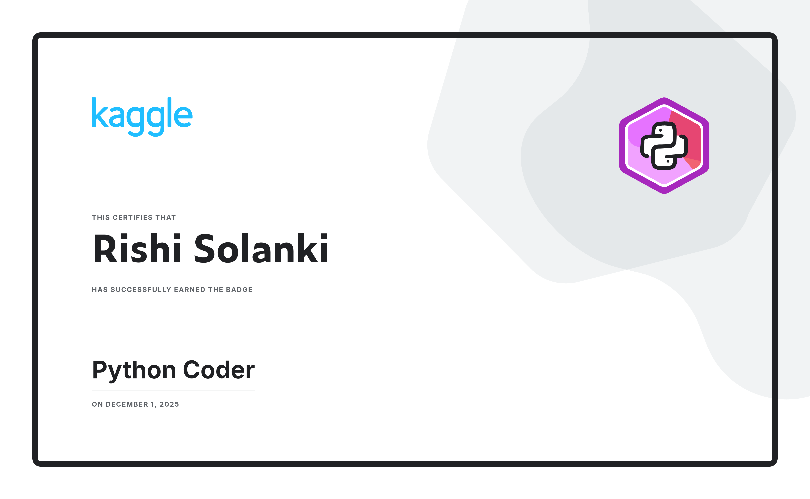
         
        <b>Python Coder & Logic Core</b> 
        <i>Advanced Logic, OOP & Backend Scripting</i>
      </td>
      <td width="33%" align="center" valign="top">
        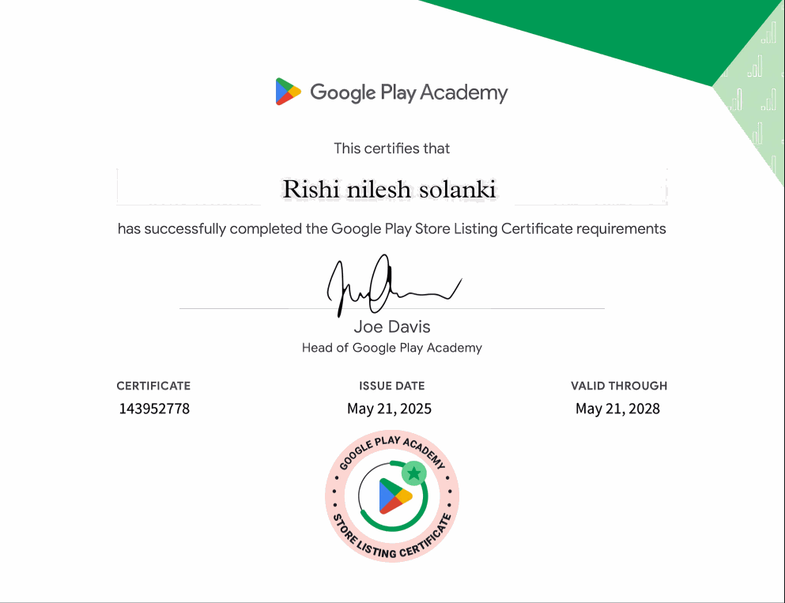
         
        <b>Google Play Store Publishing</b> 
        <i>Production Mobile App Store Deployments</i>
      </td>
    </tr>
  </table>

---

### 🎖️ Honors, Leadership & Sports Milestones

  <table>
    <tr>
      <td width="25%" align="center" valign="top">
        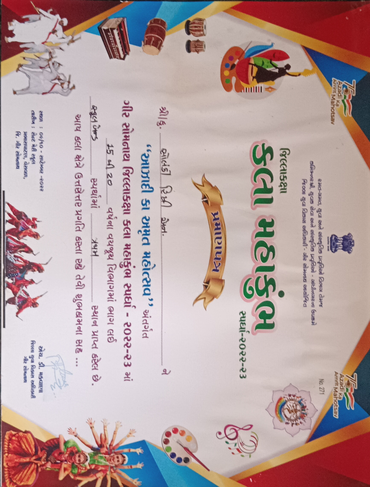 
        🥇 <b>State School Band Champion</b> 
        <i>1st Place Winner</i>
      </td>
      <td width="25%" align="center" valign="top">
        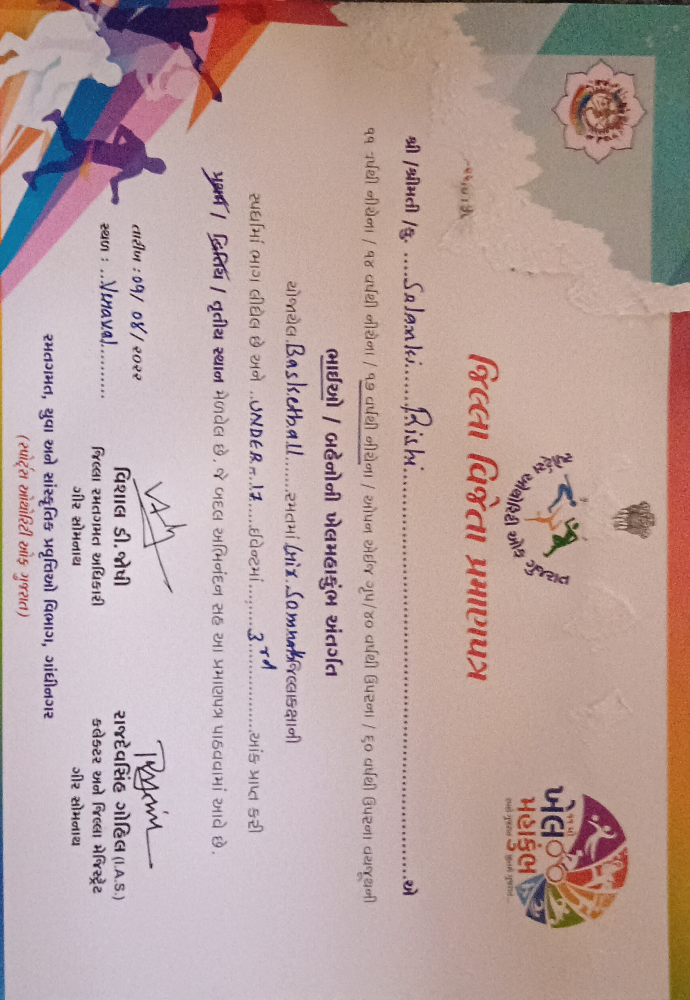 
        🥉 <b>State Basketball 3rd Place</b> 
        <i>State Championship Podium</i>
      </td>
      <td width="25%" align="center" valign="top">
        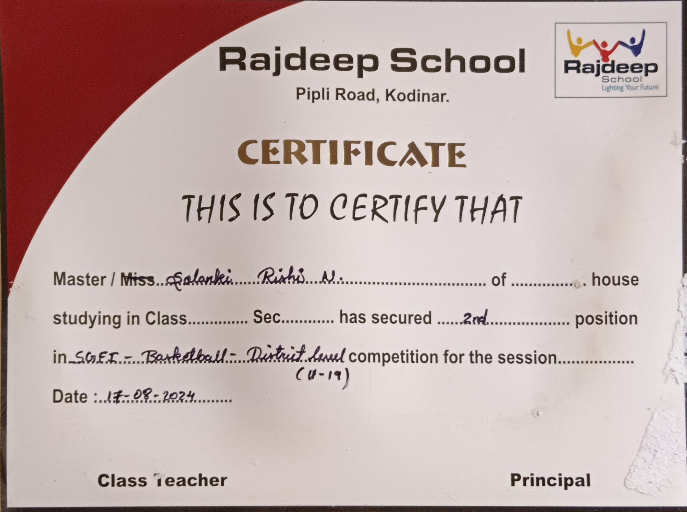 
        🏀 <b>SGFI National & State Finalist</b> 
        <i>5-Time State Champion in School</i>
      </td>
      <td width="25%" align="center" valign="top">
        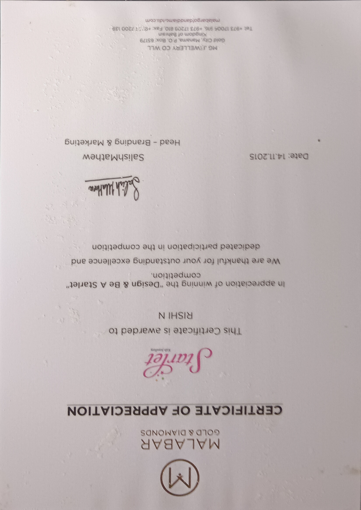 
        💎 <b>Malabar Gold 1st Prize</b> 
        <i>Jewellery Design Champion</i>
      </td>
    </tr>
  </table>

---

### 📊 Operational Metrics & GitHub Analytics

  

    
    
  

   

  <table align="center">
    <tr>
      <td align="center" valign="middle">
        
      </td>
      <td align="center" valign="middle">
        
      </td>
    </tr>
  </table>

   

  

---

### 📡 Communications Array (Connect with Me)

- 🌐 **Live 3D Portfolio**: [rishi-n-solanki.vercel.app](https://rishi-n-solanki.vercel.app)
- 💼 **LinkedIn**: [linkedin.com/in/rishi-solanki-505a9b380](https://www.linkedin.com/in/rishi-solanki-505a9b380/)
- 🐙 **GitHub**: [@Rishi-n-s](https://github.com/Rishi-n-s)
- 📧 **Email**: [rishisolanki7319@gmail.com](mailto:rishisolanki7319@gmail.com)
- 📍 **Location**: Ahmedabad & Veraval, Gujarat, India

 

  
   
  <i>"Ad Astra Per Aspera" — To the stars through difficulties.</i>
   
  <b>© 2026 Rishi Nilesh Solanki (Maruti) • All Rights Reserved</b>

